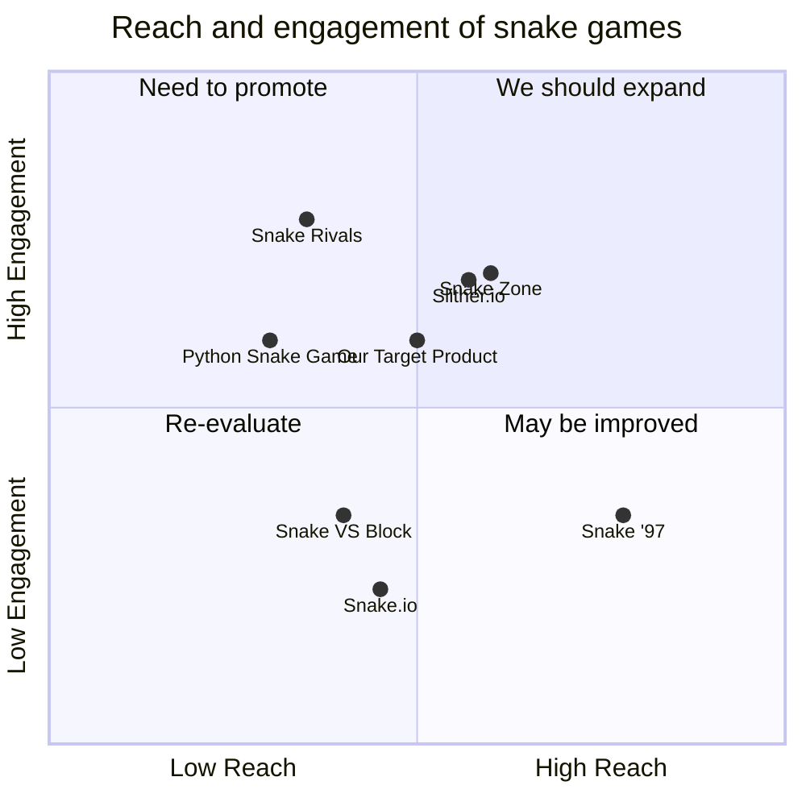

## Original Requirements:
The boss wants you to design a snake game.

## Product Goals:
- Create a fun and addictive snake game that keeps users engaged.
- Provide a smooth and responsive gameplay experience.
- Include various levels and challenges to keep the game interesting.

## User Stories:
- As a user, I want to be able to control the snake's movement using arrow keys.
- As a user, I want the snake to grow longer and increase in speed as it eats food.
- As a user, I want to see my score and the high score on the screen.
- As a user, I want to be able to pause and resume the game.
- As a user, I want to have different levels of difficulty to choose from.

## Competitive Analysis:
- Python Snake Game: A simple snake game with basic graphics and controls.
- Snake.io: A multiplayer snake game where players compete against each other.
- Slither.io: A popular online multiplayer snake game with a large player base.
- Snake '97: A nostalgic snake game that mimics the classic Nokia snake game.
- Snake VS Block: A unique twist on the snake game where the snake has to break through blocks.
- Snake Rivals: Another multiplayer snake game with different game modes.
- Snake Zone: A modern snake game with colorful graphics and power-ups.

## Competitive Quadrant Chart:


## Requirement Analysis:
The product should be a snake game with smooth controls, increasing difficulty, and a scoring system. It should also have multiple levels and the ability to pause and resume the game.

## Requirement Pool:
```python
[
    ("The snake should grow longer and increase in speed as it eats food", "P0"),
    ("The game should display the player's score and the high score", "P0"),
    ("The game should have different levels of difficulty", "P1"),
    ("The player should be able to pause and resume the game", "P1"),
    ("The game should have smooth and responsive controls", "P2")
]
```

## UI Design draft:
The game will have a simple and clean design. The main screen will display the snake, food, and the player's score. There will be arrow keys for controlling the snake's movement. The game will also have a pause button for pausing and resuming the game. The levels and difficulty options will be accessible from a settings menu.

## Anything UNCLEAR:
There are no unclear points.