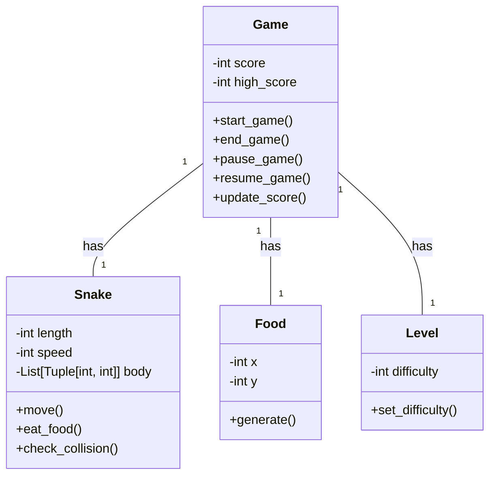
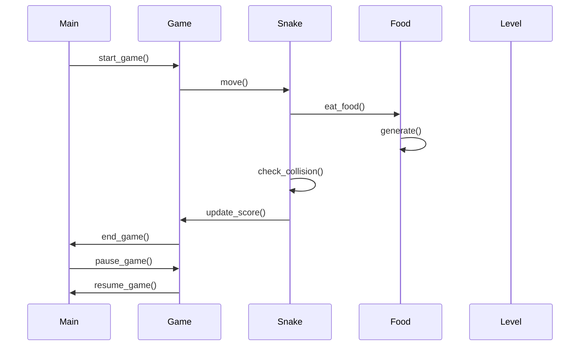

## Implementation approach:
For the snake game implementation, we will use the Pygame library, which is a popular open-source library for game development in Python. Pygame provides a simple and efficient way to create games with smooth controls and graphics. It also has built-in functions for handling keyboard input and collision detection, which are essential for implementing the snake game.

## Python package name:
```python
"snake_game"
```

## File list:
```python
[
    "main.py",
]
```

## Data structures and interface definitions:


## Program call flow:


## Anything UNCLEAR:
The requirements are clear and there are no unclear points.